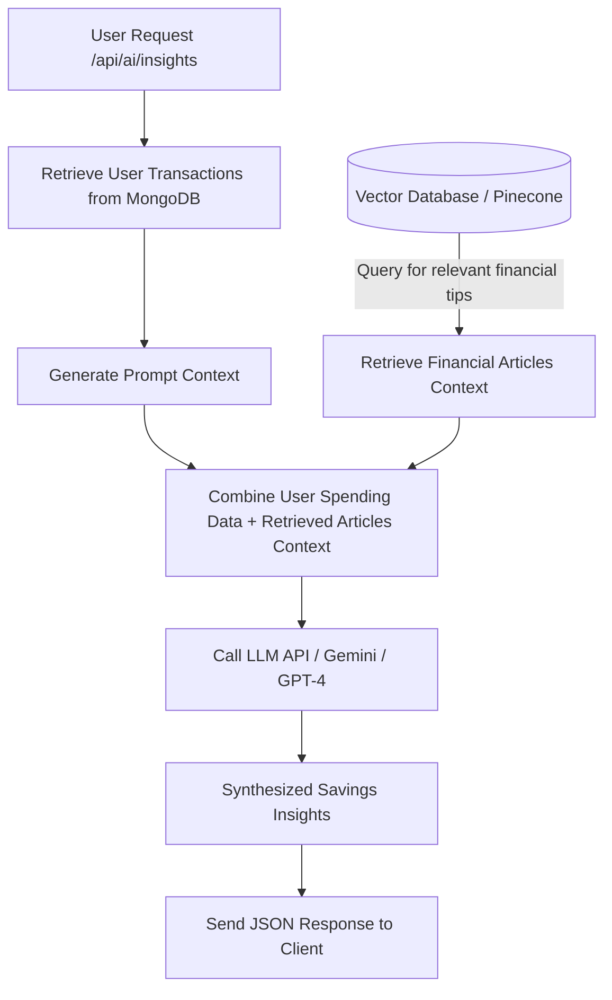

# AI Integration Guide - Spend Smart RAG Pipeline

This document guides you on how to replace the current placeholder insights in `server/controllers/aiController.js` with a complete, production-grade **Retrieval-Augmented Generation (RAG)** pipeline.

---

## Architecture Overview



---

## Steps to Implement

### 1. Vector Database Setup
1. Create a database index on **MongoDB Atlas Vector Search**, **Pinecone**, or **ChromaDB**.
2. Chunk and embed static financial guides (e.g., standard budgeting guidelines, smart savings tips, investment advice).
3. Store the embeddings in your vector index using the same vector dimensions as your embedding model (e.g., `1536` for OpenAI's `text-embedding-3-small`, or `768` for Gemini Embeddings).

### 2. Connect Your Backend Service
Install an LLM SDK and Vector DB client:
```bash
npm install @google/generative-ai @pinecone-database/pinecone
```

### 3. Implement the Embedding & Retrieval Flow
In `server/controllers/aiController.js`:
```javascript
const { GoogleGenAI } = require("@google/generative-ai");

// 1. Get embedding for the user's situation query (e.g. "how to save food expenses")
const ai = new GoogleGenAI({ apiKey: process.env.GEMINI_API_KEY });
const model = ai.getGenerativeModel({ model: "text-embedding-004" });
const embeddingResult = await model.embedContent("spending query");
const embeddingVector = embeddingResult.embedding.values;

// 2. Query Vector DB with user embedding vector to get context
const queryResponse = await pineconeIndex.query({
  vector: embeddingVector,
  topK: 3,
  includeMetadata: true
});
const financialTipsContext = queryResponse.matches.map(m => m.metadata.text).join("\n");
```

### 4. Synthesize with LLM
Use the retrieved context and user's spending data in a system prompt to request customized savings tips from a LLM:
```javascript
const chatModel = ai.getGenerativeModel({ model: "gemini-1.5-flash" });

const prompt = `
You are a personal finance assistant. Here is the user's spending profile:
- Total Income: ₹${totalIncome}
- Total Expense: ₹${totalExpense}
- Balance: ₹${totalIncome - totalExpense}
- Category Expenses: ${JSON.stringify(categoryTotals)}

Here are some general financial guidelines that may be relevant:
${financialTipsContext}

Analyze the user's spending behavior and provide exactly 3 bullet-pointed, actionable savings tips tailored to their situation. Keep them concise and polite.
`;

const result = await chatModel.generateContent(prompt);
const synthesizedText = result.response.text();

res.json({
  insights: [synthesizedText],
  success: true
});
```

---

## Environment Variables to Add in `.env`
Ensure you add the API keys to your `server/.env`:
- `GEMINI_API_KEY=your_gemini_api_key_here`
- `PINECONE_API_KEY=your_pinecone_api_key_here`
- `PINECONE_ENVIRONMENT=us-east-1`
