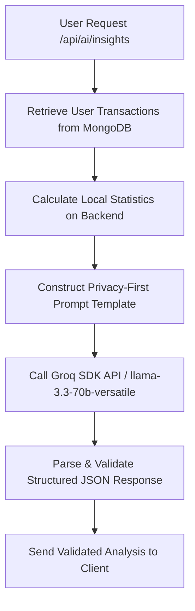

# AI Integration Guide - Spend Smart Groq Pipeline

This document details the configuration and architecture of the AI-powered financial insights feature using the Groq API.

---

## Architecture Overview



---

## Implementation Details

### 1. Privacy-First Data Aggregation
Instead of forwarding raw transaction descriptions or sensitive user identifiers to the AI API, the backend calculates all finance metrics locally:
*   Total income, expenses, and current balances.
*   Category spending breakdowns.
*   Savings rate metrics.
*   Monthly trends.
*   Average and maximum transactions.

Only these anonymous numbers are sent to Groq.

### 2. SDK Integration
The integration is built on the official `groq-sdk` Node package:
```javascript
const Groq = require("groq-sdk");
const groq = new Groq({ apiKey: process.env.GROQ_API_KEY });
```

### 3. Model Configuration
We utilize **`llama-3.3-70b-versatile`** because:
*   It supports **JSON Mode** (`response_format: { type: "json_object" }`).
*   It has extremely fast response times.
*   It provides high-capacity reasoning to deliver reliable financial analyses.

---

## Environment Variables Configuration
Ensure the API key is defined in `server/.env`:
```env
GROQ_API_KEY=gsk_your_groq_api_key_here
```
